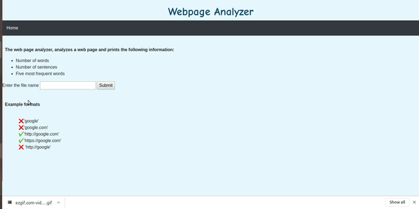

# Building a WebPage Analyzer using Flask

## The web page analyzer, analyzes a web page and prints the following information:
           
         * Number of words
         * Number of sentences
         * Five most frequent words
            

## Technology used
*Flask
*Python,BeautifulSoup
*html,css,nltk 

## Few things I learned by doing this project:
*How to use python Flask,BeautifulSoup
*Remove stopwords using nltk
*How to validate a URL format using Regular Expression

## How to run 

*install flask and nltk
*run the main.py file
